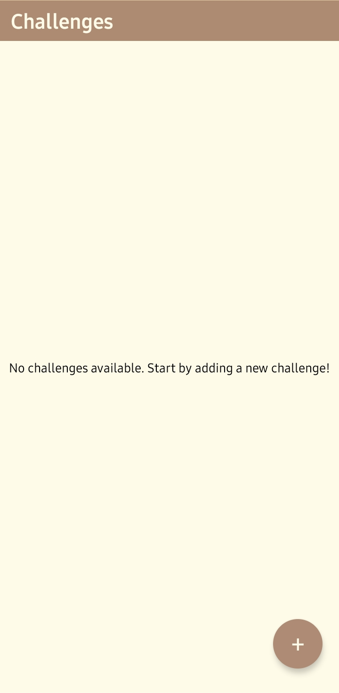
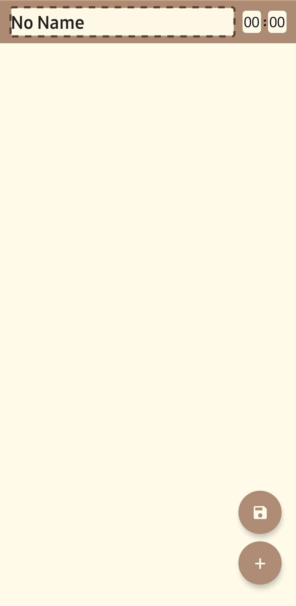

# 📱 แบบฟอร์มส่งงานสอบ Take-home
**ชื่อ - นามสกุล (Full Name):** ```Khemachat Sittiritkawin```  
**รหัสนักศึกษา (Student ID):** ```6631503005```  
**ชื่อแอป (App Name):** ```GoalForge```    
**Framework ที่ใช้ (Framework Used):** ```React Native```  
**ลิงก์ GitHub Repository:** [here](https://github.com/khemachat-sittiritkawin/2025MD-Take_Home.git)   
**ลิงก์ไฟล์ติดตั้ง (APK/IPA):** [here](https://github.com/khemachat-sittiritkawin/2025MD-Take_Home/releases/download/release/app-release.apk)

---

## 1. การออกแบบแอป | App Concept and Design (2 คะแนน / 2 pts)

### 1.1 ผู้ใช้งานเป้าหมาย | User Personas  
```markdown
Persona 1:  
- ชื่อ: เจ  
- อายุ: 20 ปี  
- อาชีพ: นักศึกษา  
- ความต้องการ: ต้องการจัดการเป้าหมายในเกม เช่น การเก็บเลเวล การทำเควสต์รายวัน และการสะสมไอเท็มหายาก  

Persona 2:  
- ชื่อ: แพท  
- อายุ: 27 ปี  
- อาชีพ: พนักงานบริษัท  
- ความต้องการ: ต้องการวางแผนการเล่นเกมในเวลาว่าง เช่น การเข้าร่วมกิจกรรมในเกม การเล่นโหมดจัดอันดับ และการทำภารกิจพิเศษ  

Persona 3:  
- ชื่อ: บอส  
- อายุ: 32 ปี  
- อาชีพ: สตรีมเมอร์  
- ความต้องการ: ต้องการจัดการตารางการสตรีมเกม เช่น การเตรียมตัวสำหรับทัวร์นาเมนต์ การเล่นเกมใหม่เพื่อสร้างคอนเทนต์ และการจัดกิจกรรมกับผู้ชม  
```

### 1.2 เป้าหมายของแอป | App Goals  
```markdown
- ช่วยวางแผนงานย่อยต่างๆ ที่มีเวลาจำกัดน้อย   
```

### 1.3 โครงร่างหน้าจอ / Mockup  






### 1.4 การไหลของผู้ใช้งาน | User Flow  
```markdown
สร้าง challenge: เปิดแอป > กดปุ่ม"+" > กรอกชื่อchallenge > กดปุ่ม"+" > กรอกชื่องาน > เลือกเวลา > กลับไปที่"กดปุ่ม'+'" > กดเครื่องหมายบันทึก

เล่น challenge: เปิดแอป > เลือกchallenge > กด"Start" > กด"Finish"เมื่อทำงานนั้นเสร็จ(จนกว่าจะหมด) > กดrestart หรือกดกลับเพื่อออกไปหน้าhome
```

---

## 2. การพัฒนาแอป | App Implementation (4 คะแนน / 4 pts)

### 2.1 รายละเอียดการพัฒนา | Development Details  
**เครื่องมือที่ใช้ / Tools used:**
```markdown
- React Native 3.19
- Typescript 5.3.3
```

### 2.2 ฟังก์ชันที่พัฒนา | Features Implemented  
**Checklist:**
```markdown
- [x] เพิ่ม / แก้ไข / ลบ challenge
- [x] แก้ไข task
- [x] จับเวลาทำchallenge
```

### 2.3 ภาพหน้าจอแอป | App Screenshots  
**Home**
   
**Editor**  
      
**Player**


---

## 3. การ Build และติดตั้งแอป | Deployment (2 คะแนน / 2 pts)

### 3.1 ประเภท Build | Build Type
- [x] Debug  
- [x] Release  

### 3.2 แพลตฟอร์มที่ทดสอบ | Platform Tested  
- [x] Android  
- [ ] iOS  

### 3.3 ไฟล์ README และวิธีติดตั้ง | README & Install Guide  
```markdown
1. ดาวน์โหลดไฟล์ .apk จาก https://github.com/khemachat-sittiritkawin/2025MD-Take_Home/releases/download/release/app-release.apk
2. เปิดในอุปกรณ์ Android
3. ติดตั้งผ่าน File Manager
```

---

## 4. การสะท้อนผลลัพธ์ | Reflection (2 คะแนน / 2 pts)
```markdown
- พบปัญหาความแม่นยำของหน่วยของเวลา ซึ่งเป็นสาเหตุที่แอปนี้ไม่มีหน่วยmillisecondในนาฬิกา เพราะว่าหน่วยmillisecondทำให้แอปทำงานช้า เนื่องจากต้องre-render componentอยู่1000รอบต่อวินาที
- พบปัญหาในการเก็บ/อ่านข้อมูลจากAsyncStorage เนื่องจากข้อมูลJSONที่ได้มาจากAsyncStorageเป็นJSONเปล่าๆ นั่นคือobjectนั้นจะไม่มีmethodsที่ควรมี นี้จึงทำให้การparseข้อมูลจึงยากมากขึ้น ซึ่งวิธีแก้นั่นคือต้องส่งข้อมูลที่อยู่ในobjectเปล่าเป็นargumentในconstructorของclassที่เรากำหนดไว้
```

---

## 5. การใช้ AI ช่วยพัฒนา | AI Assisted Development (Bonus / ใช้ประกอบการพิจารณา)

### 5.1 ใช้ AI ช่วยคิดไอเดีย | Idea Generation
```markdown
Prompt ที่ใช้:  
"Give me a better prompt than 'give me app ideas'"
ผลลัพธ์: ได้promptเพื่อหาไอเดียแอปที่ดีกว่าprompt "give me app ideas"

```

### 5.2 ใช้ AI ช่วยออกแบบ UI | UI Layout Prompt
```markdown
Prompt ที่ใช้:  
"Fix the UI"
ผลลัพธ์: AIแก้styleในcomponent ทำให้UIดูสวยขึ้น

"How do I grey out these buttons when isStarted is false"
ผลลัพธ์: AIแก้โค้ดทำให้ปุ่มกลายเป็นสีเทาเวลาตัวแปรisStartedเป็นเท็จ

"How do i add a transparent modal pop-up that shows how much time it took to complete the tasks"
ผลลัพธ์: AIให้โค้ดเพื่อร่างโครงmodal

"Find a better text color"
ผลลัพธ์: AIให้โค้ดเพื่อร่างโครงmodal

"This pop-up looks kind of lame to me. Can you make it look better?"
ผลลัพธ์: AIแก้UIเพื่อให้หน้าpop-upดูดีขึ้น

```

### 5.3 ใช้ AI ช่วยเขียนโค้ด | Code Writing Prompt
```markdown
Prompt ที่ใช้:  
"How do i format a single-digit integer to a two-digit string."
ผลลัพธ์: ได้โค้ดเพื่อformatเลขหนึ่งหลักให้กลายเป็นสองหลัก

"Change status bar's color"
ผลลัพธ์: AIแก้สีของStatusBarเพื่อให้กลมกลื่นกับแอป

"How do i make a provider"
ผลลัพธ์: AIสอนวิธีการใช้ฟีเจอร์Providerของreact

"How do I make the screen to call the refreshItems function when I navigate back to it"
ผลลัพธ์: AIใช้useFocusEffectกับuseCallbackเพื่อเรียกฟังก์ชั้นrefreshItemsเพื่อจัดเรียงรายการอีกรอบ

"How would you improve this component for entering time"
ผลลัพธ์: AIแก้โค้ดของcomponent

```

### 5.4 ใช้ AI ช่วย debug | Debug Prompt
```markdown
ไม่มี
```

### 5.5 ใช้ AI ช่วย Deploy | Deployment Prompt
```markdown
ไม่มี
```

---

## ✅ Checklist ก่อนส่ง | Final Checklist
- [x] กรอกข้อมูลครบทุก Section  
- [x] แนบ GitHub และไฟล์ติดตั้ง  
- [x] สะท้อนผล และใช้ AI อย่างมีเหตุผล  
